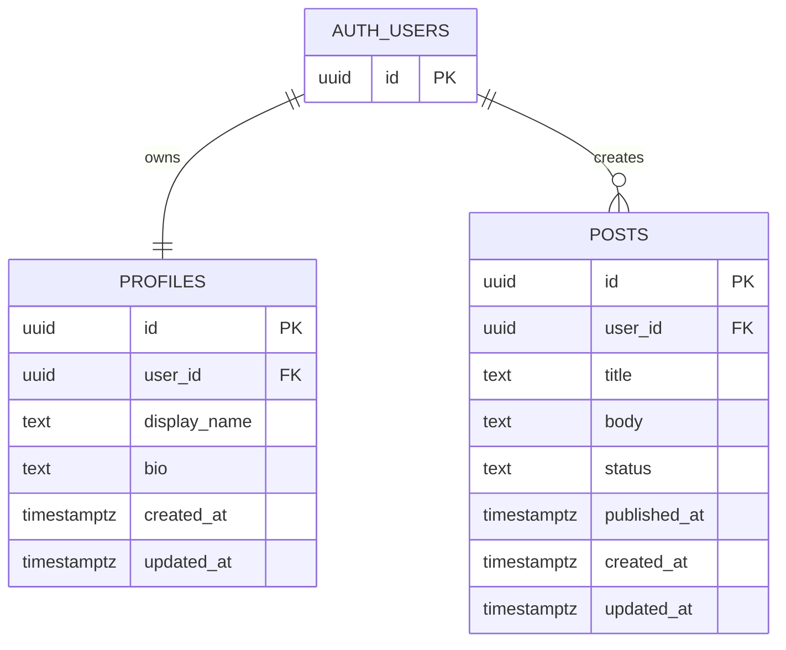

# ER図 Mermaid

## 補足

- `AUTH_USERS` は Supabase Auth の `auth.users` を表す
- `PROFILES.user_id` は `AUTH_USERS.id` に対する一意な外部キーで、1 ユーザー 1 プロフィール
- `POSTS.user_id` は `AUTH_USERS.id` に対する外部キーで、1 ユーザーが複数投稿を持つ
- `posts.status` の取り得る値は `draft`、`published`、`archived`

## draw.io 取込手順

`Arrange` → `Insert` → `Advanced` → `Mermaid` から、上記コードブロック内の Mermaid を貼り付けて読み込む。
