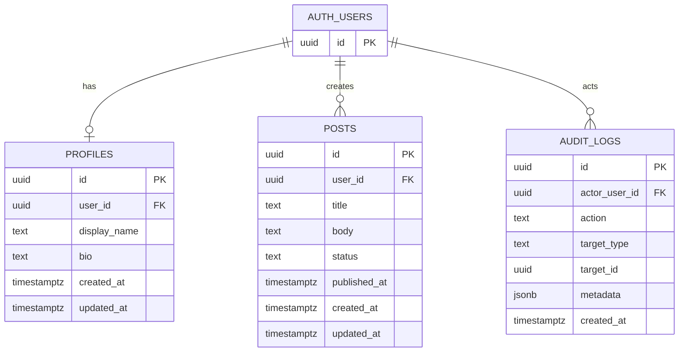

# ER図 Mermaid

```mermaid
erDiagram
    AUTH_USERS ||--o| PROFILES : has
    AUTH_USERS ||--o{ POSTS : creates
    AUTH_USERS ||--o{ AUDIT_LOGS : acts

    AUTH_USERS {
        uuid id PK
    }

    PROFILES {
        uuid id PK
        uuid user_id FK
        text display_name
        text bio
        timestamptz created_at
        timestamptz updated_at
    }

    POSTS {
        uuid id PK
        uuid user_id FK
        text title
        text body
        text status
        timestamptz published_at
        timestamptz created_at
        timestamptz updated_at
    }

    AUDIT_LOGS {
        uuid id PK
        uuid actor_user_id FK
        text action
        text target_type
        uuid target_id
        jsonb metadata
        timestamptz created_at
    }
```

## draw.io 取込手順

`Arrange` → `Insert` → `Advanced` → `Mermaid` から、上記コードブロック内の Mermaid を貼り付けて読み込む。
