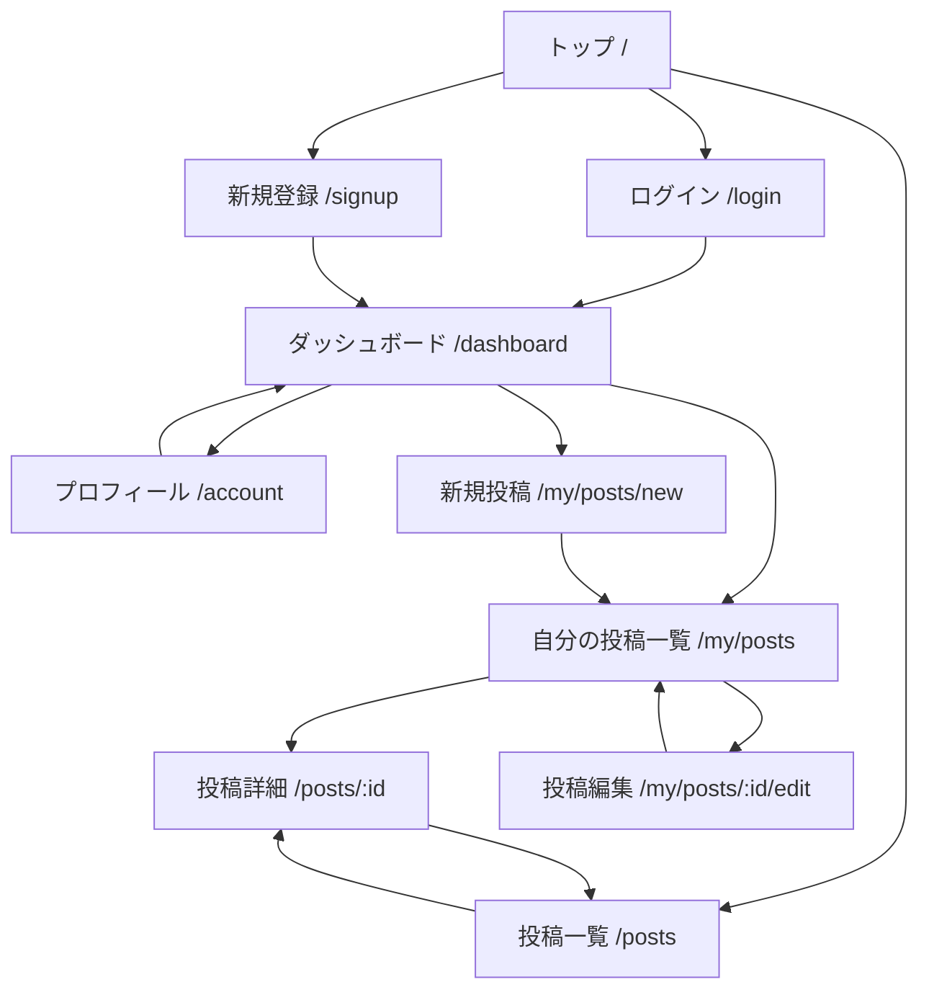

# 画面遷移図

## 1. 画面一覧

| 画面ID | 画面名 | パス | 利用者 |
|---|---|---|---|
| SCR-01 | トップ | `/` | ゲスト、会員 |
| SCR-02 | ログイン | `/login` | ゲスト |
| SCR-03 | 新規登録 | `/signup` | ゲスト |
| SCR-04 | 投稿一覧 | `/posts` | ゲスト、会員 |
| SCR-05 | 投稿詳細 | `/posts/:id` | ゲスト、会員 |
| SCR-06 | ダッシュボード | `/dashboard` | 会員 |
| SCR-07 | プロフィール | `/account` | 会員 |
| SCR-08 | 自分の投稿一覧 | `/my/posts` | 会員 |
| SCR-09 | 新規投稿 | `/my/posts/new` | 会員 |
| SCR-10 | 投稿編集 | `/my/posts/:id/edit` | 会員 |

## 2. 画面遷移図

## 3. 遷移ルール

- 未ログインユーザーは `トップ`、`ログイン`、`新規登録`、`投稿一覧`、`投稿詳細` に遷移可能
- 会員ユーザーは `ダッシュボード` を起点に `プロフィール`、`自分の投稿一覧`、`新規投稿`、`投稿編集` に遷移可能
- 認可は画面制御だけでなく、Supabase の RLS でも強制する
