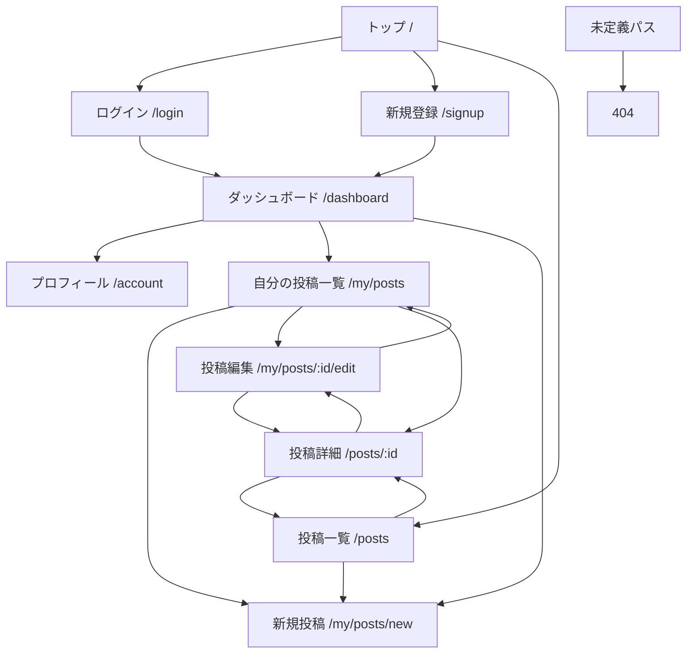

# 画面一覧 / 遷移図

## 1. 画面一覧

| 画面ID | 画面名 | パス | 利用者 |
|---|---|---|---|
| SCR-01 | トップ | `/` | ゲスト、会員 |
| SCR-02 | ログイン | `/login` | ゲスト |
| SCR-03 | 新規登録 | `/signup` | ゲスト |
| SCR-04 | ダッシュボード | `/dashboard` | 会員 |
| SCR-05 | プロフィール | `/account` | 会員 |
| SCR-06 | 投稿一覧 | `/posts` | ゲスト、会員 |
| SCR-07 | 投稿詳細 | `/posts/:id` | ゲスト、会員 |
| SCR-08 | 自分の投稿一覧 | `/my/posts` | 会員 |
| SCR-09 | 新規投稿 | `/my/posts/new` | 会員 |
| SCR-10 | 投稿編集 | `/my/posts/:id/edit` | 会員 |
| SCR-11 | 404 | その他 | ゲスト、会員 |

## 2. 画面遷移図

## 3. 遷移ルール

- 未ログインユーザーは `トップ`、`ログイン`、`新規登録`、`投稿一覧`、`投稿詳細` に遷移できる
- `ダッシュボード`、`プロフィール`、`自分の投稿一覧`、`新規投稿`、`投稿編集` は認証必須画面とする
- 未ログイン状態で認証必須画面にアクセスした場合は通知を表示して `ログイン` へ遷移する
- ログイン済み状態で `/login` または `/signup` にアクセスした場合はフォームの代わりに `ダッシュボード` を表示する
- `投稿一覧` から `新規投稿` への導線はログイン中のみ表示する
- `投稿詳細` では自分の投稿であれば `投稿編集` と `投稿削除` を実行できる
- `投稿詳細` から自分の投稿を削除した場合は `自分の投稿一覧` へ遷移する
- 未定義パスは `404` を表示する

## 4. 補足

- 実装上のルーティングはハッシュルーティングであり、URL 表示は `#/posts` のような形式になる
- 会員画面の主要導線は `ダッシュボード` を起点とする
- `投稿詳細` の URL 自体は誰でも開けるが、非公開投稿は本人のみ閲覧できる
